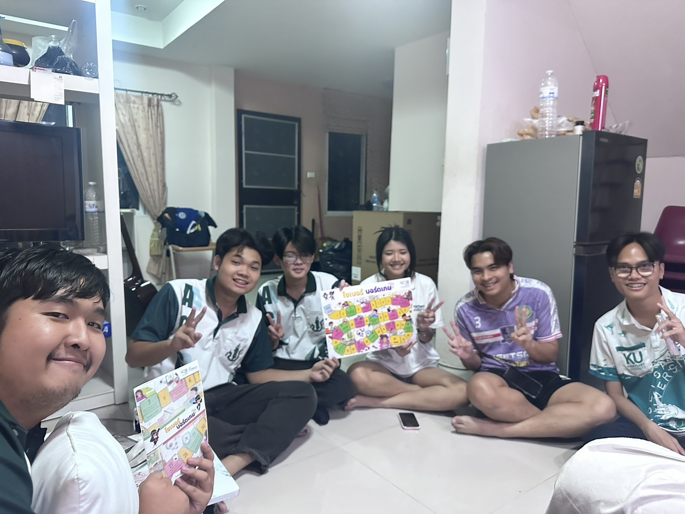
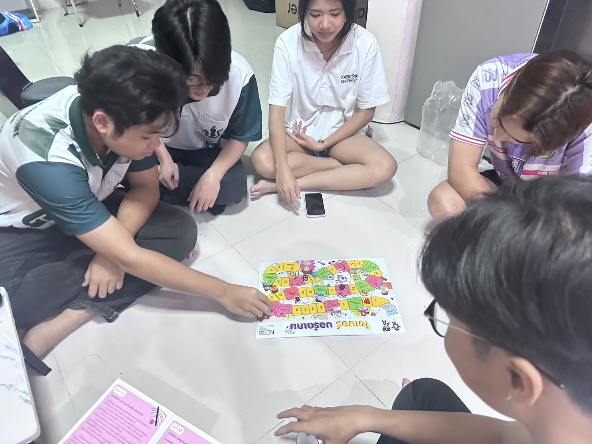

# Board Game Activity

#### บรรยากาศภายในการทำกิจกรรมการเล่นบอร์ดเกม
จัดโดยสำนักงานคณะกรรมการการรักษาความมั่นคงปลอดภัยไซเบอร์แห่งชาติ (สกมช. หรือ NCSA)

บอร์ดเกมถูกออกแบบมาให้มีความรู้เกี่ยวกับความปลอดภัยในโลกไซเบอร์ในระหว่างการเล่นเกม

## วันที่ทำกิจกรรม
####  วันพฤหัสบดี ที่ 23 มกราคม 2568

## รายละเอียดของกิจกรรม

กิจกรรมนี้จัดทำโดยกลุ่ม **“ JapJapzaTaluiLok ”**
นิสิต คณะวิทยาศาสตร์ ศรีราชา สาขาวิทยาการคอมพิวเตอร์

กิจกรรมนี้เป็นการเล่น **Board Game** ที่ให้ความรู้การป้องกันทางไซเบอร์
ซึ่งเป็นของสำนักงานคณะกรรมการการรักษาความมั่นคงปลอดภัยไซเบอร์แห่งชาติ (สกมช. หรือ NCSA)

วิธีการเล่นบอร์ดเกม
เหมือนกับการเล่นเกมบรรไดงู โดยถ้าผู้เล่นทอยลูกเต๋าแล้วตัวละครของผู้เล่นตกลงในช่อง **‘เขียว’** หรือ **‘แดง’**
ทางกรรมการจะอ่านผลลัพท์ของช่องนั้นให้ผู้เล่นฟัง และอธิบายเนื้อหาของการกระทำทางไซเบอร์ไม่ว่าจะดีหรือไม่ดี

เกมจะจบลงก็ต่อเมื่อ ผู้เล่นไปถึงที่จุดจบของ Board Game

## จุดประสงค์ของกิจกรรม
เพื่อเสริมสร้างความตระหนักรู้เกี่ยวกับภัยไซเบอร์ให้แก่นักเรียน นักศึกษา และประชาชนทั่วไป

## ผู้เล่นที่เข้าร่วมกิจกรรม
- คนในกลุ่ม "JapJapzaTaluiLok" 3 คน
- นิสิตคณะเศรษฐศาสตร์

## สมาชิกภายในกลุ่ม
[Pattaravut Sukbot](https://pattaravut.github.io/)

[Ukrit Johneak](https://zenogarb.github.io/)

[Kittamaet Rongkham](https://ohmykk.github.io/)

[Songwut Sudtalai](https://gunqeq.github.io/)
